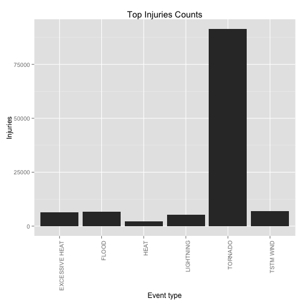
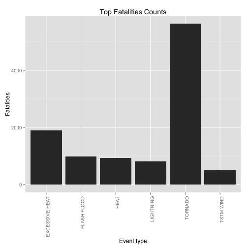
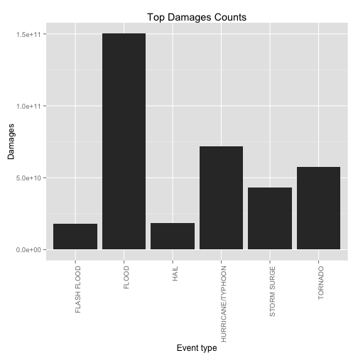

Title
========================================================

# Synopsis

# Data Processing

```r
storm <- read.csv("repdata-data-StormData.csv.bz2")
numObs <- dim(storm)
```


According to the provided documentation, the possible events should be 48. Unfortunately, perhaps because of a not enough guided data entry procedure, across all 902297, 37 observations the number of possible events is much higher, in fact it is almost 1000:

```r
length(levels(storm$EVTYPE))
```

```
## [1] 985
```

Anyway, the questions that we are asked to answer are the following:

* Across the United States, which types of events (as indicated in the EVTYPE variable) are most harmful with respect to population health?
* Across the United States, which types of events have the greatest economic consequences?

So, even if our original data contain more than 900000 samples, we can restrict our analysis to those samples that have at least one of the following columns not equal to 0:
* FATALITIES
* INJURIES
* PROPDMG
* CROPDMG


```r
storm <- storm[(storm$FATALITIES != 0) | (storm$INJURIES != 0) | (storm$PROPDMG != 
    0) | (storm$CROPDMG != 0), ]
```


Furthermore, only a subset of the available columns are necessary for our analysis, so we can subset our original dataframe like this:


```r
storm <- data.frame(storm$EVTYPE, storm$FATALITIES, storm$INJURIES, storm$PROPDMG, 
    storm$PROPDMGEXP, storm$CROPDMG, storm$CROPDMGEXP, stringsAsFactors = FALSE)
str(storm)
```

```
## 'data.frame':	254633 obs. of  7 variables:
##  $ storm.EVTYPE    : Factor w/ 985 levels "   HIGH SURF ADVISORY",..: 834 834 834 834 834 834 834 834 834 834 ...
##  $ storm.FATALITIES: num  0 0 0 0 0 0 0 0 1 0 ...
##  $ storm.INJURIES  : num  15 0 2 2 2 6 1 0 14 0 ...
##  $ storm.PROPDMG   : num  25 2.5 25 2.5 2.5 2.5 2.5 2.5 25 25 ...
##  $ storm.PROPDMGEXP: Factor w/ 19 levels "","-","?","+",..: 17 17 17 17 17 17 17 17 17 17 ...
##  $ storm.CROPDMG   : num  0 0 0 0 0 0 0 0 0 0 ...
##  $ storm.CROPDMGEXP: Factor w/ 9 levels "","?","0","2",..: 1 1 1 1 1 1 1 1 1 1 ...
```


Now we need to normalize the *PROPDMGEXP* and *CROPDMGEXP* because, in the form they are given, they are useless for us.


```r
storm$storm.PROPDMGEXP <- as.character(storm$storm.PROPDMGEXP)
storm$storm.CROPDMGEXP <- as.character(storm$storm.CROPDMGEXP)

storm$storm.PROPDMGEXP[(storm$storm.PROPDMGEXP == "")] <- 0
storm$storm.PROPDMGEXP[(storm$storm.PROPDMGEXP == "+") | (storm$storm.PROPDMGEXP == 
    "-") | (storm$storm.PROPDMGEXP == "?")] <- 1
storm$storm.PROPDMGEXP[(storm$storm.PROPDMGEXP == "h") | (storm$storm.PROPDMGEXP == 
    "H")] <- 2
storm$storm.PROPDMGEXP[(storm$storm.PROPDMGEXP == "k") | (storm$storm.PROPDMGEXP == 
    "K")] <- 3
storm$storm.PROPDMGEXP[(storm$storm.PROPDMGEXP == "m") | (storm$storm.PROPDMGEXP == 
    "M")] <- 6
storm$storm.PROPDMGEXP[(storm$storm.PROPDMGEXP == "B")] <- 9

storm$storm.CROPDMGEXP[(storm$storm.CROPDMGEXP == "")] <- 0
storm$storm.CROPDMGEXP[(storm$storm.CROPDMGEXP == "+") | (storm$storm.CROPDMGEXP == 
    "-") | (storm$storm.CROPDMGEXP == "?")] <- 1
storm$storm.CROPDMGEXP[(storm$storm.CROPDMGEXP == "h") | (storm$storm.CROPDMGEXP == 
    "H")] <- 2
storm$storm.CROPDMGEXP[(storm$storm.CROPDMGEXP == "k") | (storm$storm.CROPDMGEXP == 
    "K")] <- 3
storm$storm.CROPDMGEXP[(storm$storm.CROPDMGEXP == "m") | (storm$storm.CROPDMGEXP == 
    "M")] <- 6
storm$storm.CROPDMGEXP[(storm$storm.CROPDMGEXP == "B")] <- 9

storm$storm.PROPDMGEXP <- as.integer(storm$storm.PROPDMGEXP)
storm$storm.CROPDMGEXP <- as.integer(storm$storm.CROPDMGEXP)
```


Having normalized the exponents necessary to correctly interpretate the quantities given, we can now calculate the total damage in a new column:


```r
storm$total.damage <- storm$storm.PROPDMG * 10^storm$storm.PROPDMGEXP + storm$storm.CROPDMG * 
    10^storm$storm.CROPDMGEXP
```


At this point we use the ddply function of the *plyr* package to calculate the sum of fatalities, injuries and total damages for each of the event types in the subsetted dataframe:

```r
require(plyr)
```

```
## Loading required package: plyr
```

```r
stormSummary <- ddply(storm, .(storm.EVTYPE), summarize, fatalities = sum(storm.FATALITIES), 
    injuries = sum(storm.INJURIES), damages = sum(total.damage))
```


# Results
Having prepared the dataframe with the summarized data that we need, all we have to do is extract the required statistics.
Also, we will use the *ggplot2* library plotting system.


```r
require(ggplot2)
```

```
## Loading required package: ggplot2
```


### Injuries


```r
stormInjuries <- head(stormSummary[order(stormSummary$injuries, decreasing = TRUE), 
    ])[, c(1, 3)]
print(stormInjuries)
```

```
##       storm.EVTYPE injuries
## 407        TORNADO    91346
## 423      TSTM WIND     6957
## 86           FLOOD     6789
## 61  EXCESSIVE HEAT     6525
## 258      LIGHTNING     5230
## 151           HEAT     2100
```

```r
ggplot(data = stormInjuries, aes(storm.EVTYPE, injuries)) + geom_bar(stat = "identity") + 
    theme(axis.text.x = element_text(angle = 90, hjust = 1)) + xlab("Event type") + 
    ylab("Injuries") + ggtitle("Top Injuries Counts")
```

 


### Fatalities


```r
stormFatalities <- head(stormSummary[order(stormSummary$fatalities, decreasing = TRUE), 
    ])[, c(1, 2)]
print(stormFatalities)
```

```
##       storm.EVTYPE fatalities
## 407        TORNADO       5633
## 61  EXCESSIVE HEAT       1903
## 73     FLASH FLOOD        978
## 151           HEAT        937
## 258      LIGHTNING        816
## 423      TSTM WIND        504
```

```r
ggplot(data = stormFatalities, aes(storm.EVTYPE, fatalities)) + geom_bar(stat = "identity") + 
    theme(axis.text.x = element_text(angle = 90, hjust = 1)) + xlab("Event type") + 
    ylab("Fatalities") + ggtitle("Top Fatalities Counts")
```

 


### Damages

```r
stormDamages <- head(stormSummary[order(stormSummary$damages, decreasing = TRUE), 
    ])[, c(1, 4)]
print(stormDamages)
```

```
##          storm.EVTYPE   damages
## 86              FLOOD 1.503e+11
## 224 HURRICANE/TYPHOON 7.191e+10
## 407           TORNADO 5.736e+10
## 350       STORM SURGE 4.332e+10
## 134              HAIL 1.876e+10
## 73        FLASH FLOOD 1.824e+10
```

```r
ggplot(data = stormDamages, aes(storm.EVTYPE, damages)) + geom_bar(stat = "identity") + 
    theme(axis.text.x = element_text(angle = 90, hjust = 1)) + xlab("Event type") + 
    ylab("Damages") + ggtitle("Top Damages Counts")
```

 

